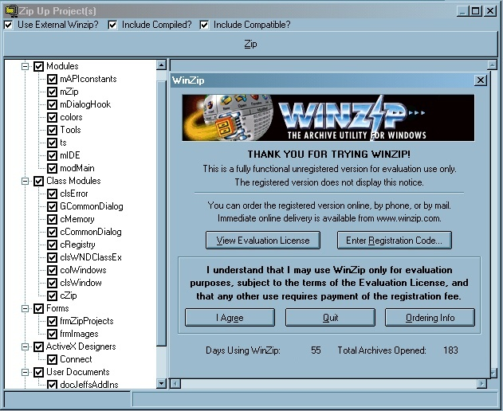

<div align="center">

## Visual Basic Add\-In To Simplify Zipping Projects  =\)


</div>

### Description

This is an add-in for VB 6 (theoretically should compile in VB5 but not tested) that provides a simple way for you to zip up your project files. I invented this add-in over a year ago now for one sole reason. As a single developer working on multiple projects, I want only 1 copy of my code in source safe... period. No shares. I want to check a module out in one app... change it... and check it back in while working on a different app. I have implemented a standard directory structure and all of my project files use relative addressing for pulling in the other files. The beauty of this add-in is that you can do this, and when it comes time to (as I often do) update a remote code base, such as home, all I have to do is select the peices of the project I want to zip in the treeview, click the button, and presto... a zip file is generated preserving the directory structure and correctly pulling in files from the other directories. =) I decided to post this up here on PSC after reading a recent post by Clint LaFever regarding the issues that affect a lot of the posts here (source safe files, workspace files, and other misc junk) when entire directories are just zipped up via Explorer. My apologies to the fellow who was whining about code people have uploaded here the other day, but while it DOES compile and it DOES work, =) it's ugly as sin. =) I'm sure there's a couple modules in there from the guys over vbAccelerator.com (I believe I left their header files in tact). So if you need a tool to help you when creating zip files of code, then download and compile this add-in. =) Particularly, please, if you plan to upload code. =) A few notes on use: the add-in works together with your existing WinZip. If you don't have it, get it (winzip.com). Originally, I developed the add-in in Windows 98... and built in ZIP dll I found worked. I didn't have to integrate with WinZip until I tried using the add-in on Windows 2000. The dll blew up. So I have omitted it from this post since we can't post dlls anyways and because all I ever use is the external option (will eventually remove that checkbox altogether I guess). Anyways... when you do click on the Use External button, WinZip will launch. Click past the ShareWare screen, and then go back to the add-in and click the ZIP button. That's about it. If you do want to include the compiled version or the compiled compatibility version, just check the appropriate boxes. =)
 
### More Info
 


<span>             |<span>
---                |---
**Submitted On**   |2001-07-18 18:53:50
**By**             |[TheFrogPrince](https://github.com/Planet-Source-Code/PSCIndex/blob/master/ByAuthor/thefrogprince.md)
**Level**          |Advanced
**User Rating**    |4.5 (36 globes from 8 users)
**Compatibility**  |VB 6\.0
**Category**       |[VB function enhancement](https://github.com/Planet-Source-Code/PSCIndex/blob/master/ByCategory/vb-function-enhancement__1-25.md)
**World**          |[Visual Basic](https://github.com/Planet-Source-Code/PSCIndex/blob/master/ByWorld/visual-basic.md)
**Archive File**   |[Add\-In To 230677182001\.zip](https://github.com/Planet-Source-Code/thefrogprince-visual-basic-add-in-to-simplify-zipping-projects__1-25212/archive/master.zip)

### API Declarations

```
Cheers, All! Enjoy!
<too many declared calls to list>
=)
```


